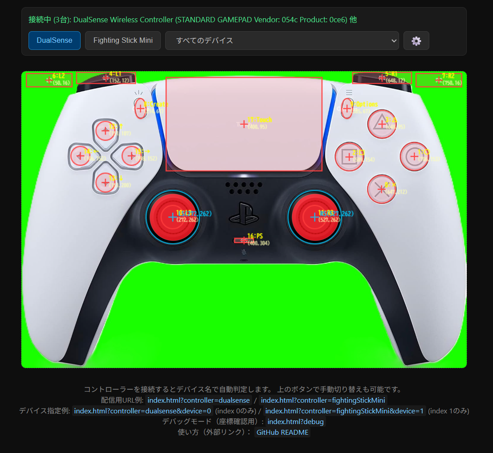
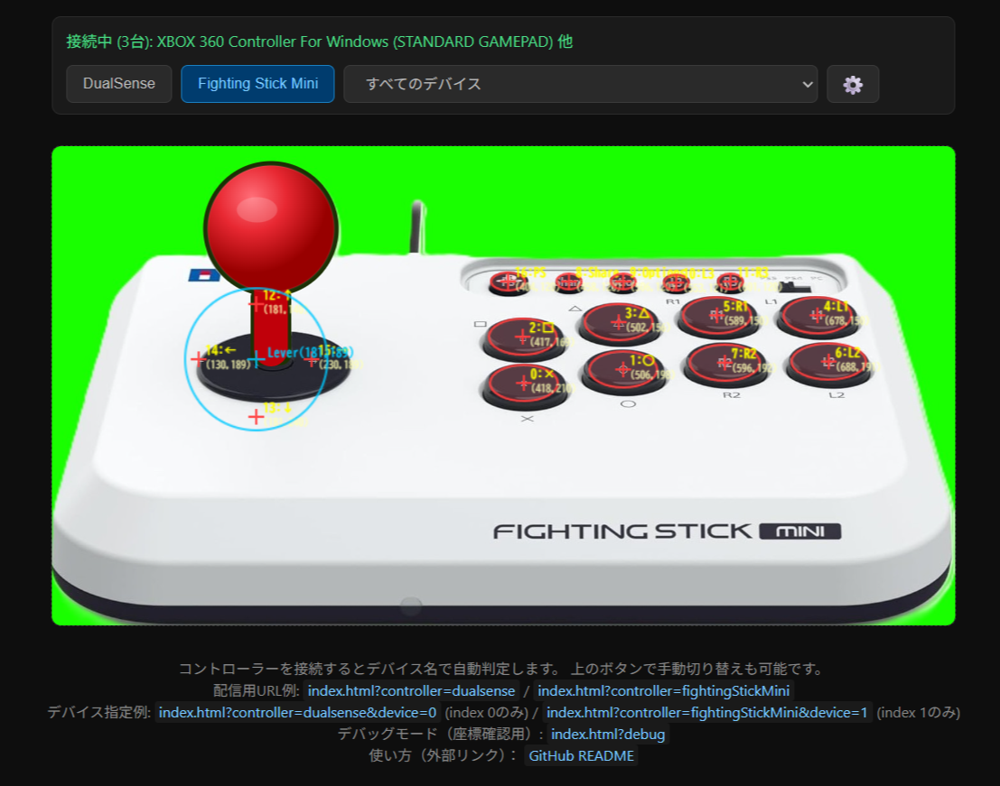

# Controller Viewer

配信・録画向けのゲームコントローラー入力可視化Webアプリです。
**DualSense（PlayStation 5）** と **Fighting Stick Mini（HORI アーケードスティック）** を主な対象とし、ボタンやレバーを押すとリアルタイムで色が変わります。

OBS などのブラウザソース（Browser Source）として読み込むだけで使えます。

---

## デモ

### DualSense (PS5)


### Fighting Stick Mini (HORI)


---

## 機能

- **Gamepad API** によるリアルタイム入力検出（USB / Bluetooth 対応）
- コントローラー写真上へのボタン/スティック オーバーレイ表示
- ボタン押下時の色反転・グローエフェクト
- アナログスティックの可動範囲と現在位置の可視化
- **デバイス名による自動マッピング切り替え**（接続するだけで自動判定）
- 手動でのコントローラー切り替えボタン

---

## 対応デバイス

| デバイス | 自動判定キーワード |
|---|---|
| DualSense (PS5) | `DualSense`, `PS5 Controller`, `PlayStation 5` |
| Fighting Stick Mini (HORI) | `Fighting Stick`, `HORI`, `Arcade Stick`, `FS-Mini`, `XBOX 360 Controller` |

> **Note:** Fighting Stick Mini は Xbox 360 互換モードで動作するため、Gamepad API の `id` は  
> `"XBOX 360 Controller For Windows (STANDARD GAMEPAD)"` と報告されます。  
> そのため `"XBOX 360 Controller"` をパターンに追加することで自動判定が機能します。

上記以外のデバイスでも接続は可能です。手動でマッピングを選択してください。

---

## ファイル構成

```
controller-viewer/
├── index.html                   # ページ本体
├── style.css                    # スタイルシート（ボタンオーバーレイ・押下エフェクト）
├── script.js                    # Gamepad API ポーリング・描画ロジック
├── config.js                    # ★ ボタン座標・デバイス名パターンの設定ファイル
└── images/
    ├── ps5_dualsense.jpg        # DualSense 実写真 (1500×1000 px)
    └── fighting_stick_mini.jpg  # Fighting Stick Mini 実写真 (1417×752 px)
```

---

## セットアップ

### 1. リポジトリをクローン

```bash
git clone https://github.com/tetchan-lab/controller-viewer.git
cd controller-viewer
```

### 2. ブラウザで開く（ローカル）

`index.html` をブラウザで直接開くか、ローカルサーバーを立ち上げます。

```bash
# Python を使った簡易サーバー（任意）
python3 -m http.server 8080
# ブラウザで http://localhost:8080 を開く
```

> **Note:** `file://` プロトコルでは Gamepad API が使えないブラウザがあります。ローカルサーバーの使用を推奨します。

### 3. コントローラーを接続

USB または Bluetooth でコントローラーを接続後、ブラウザ上で何かボタンを押してください（ブラウザのセキュリティポリシーにより、ボタン入力後に Gamepad API が有効化されます）。

自動的にデバイス名を検出し、対応するマッピングに切り替わります。

---

## OBS での使い方

1. OBS のソース一覧で **「ブラウザ」** を追加
2. URL に `http://localhost:8080` または GitHub Pages の URL を入力
3. 幅・高さをコントローラー画像のサイズに合わせる（DualSense: 800×533、Fighting Stick Mini: 800×425）
4. 「コントローラー背景を透過させたい場合」は以下を CSS カスタムに追記:
   ```css
   body { background: transparent !important; }
   ```

---

## コントローラー写真の差し替え方

1. 実際のコントローラー写真を撮影（推奨: 正面・真上から均一照明で撮影）
2. `images/` フォルダに配置（例: `images/mycontroller.jpg`）
3. `config.js` の `image` / `imageWidth` / `imageHeight` プロパティを更新:

   ```js
   // config.js
   const DUALSENSE_CONFIG = {
     image: "images/mycontroller.jpg",  // ← 実際のファイル名に変更
     imageWidth:  800,                  // ← 表示幅 (px)
     imageHeight: 533,                  // ← 表示高さ (px) ※アスペクト比を維持
     // ...
   };
   ```

> **アスペクト比の合わせ方:** `imageHeight = round(imageWidth * 元画像高さ / 元画像幅)`  
> 例: 元画像 1500×1000 → `round(800 * 1000 / 1500) = 533`

---

## ボタン座標の計測と再計算プロセス

座標は `images/` フォルダ内の**実際の写真から直接計測**した値です。
以下のプロセスで再計算できます。

### 座標系

```
(0, 0) ─────────────────────────── x
  │
  │   コントローラー画像
  │   imageWidth × imageHeight (px)
  │
  y
```

- `x`, `y` はオーバーレイ要素の**中心座標**（px）
- `w`, `h` はオーバーレイ要素の**幅・高さ**（px）

### 再計算手順

1. **元画像を表示サイズにリサイズ**  
   スケール係数 = `imageWidth ÷ 元画像幅`  
   例: DualSense → `800 ÷ 1500 = 0.533`

2. **グリッドオーバーレイ付き画像を生成して計測**  
   Python（Pillow）などでグリッド線を描画し、各ボタン中心の *(x, y)* を読み取る。

   ```python
   from PIL import Image, ImageDraw

   img = Image.open("images/ps5_dualsense.jpg").resize((800, 533))
   draw = ImageDraw.Draw(img)
   # 50px ごとにグリッド線を描画して座標を読み取る
   for x in range(0, 800, 50):
       draw.line([(x, 0), (x, 533)], fill=(255, 0, 0, 80))
   for y in range(0, 533, 50):
       draw.line([(0, y), (800, y)], fill=(255, 0, 0, 80))
   img.save("grid_dualsense.png")
   ```

3. **config.js を更新**  
   読み取った中心座標を `x`, `y` に、ボタン直径を `w`, `h` に設定する。

### 現在の座標マッピング

#### DualSense（表示サイズ: 800×533、元画像: 1500×1000）

| ボタン | index | x | y | w | h |
|---|---|---|---|---|---|
| × | 0 | 638 | 202 | 40 | 40 |
| ○ | 1 | 688 | 163 | 40 | 40 |
| □ | 2 | 585 | 163 | 40 | 40 |
| △ | 3 | 638 | 127 | 40 | 40 |
| L1 | 4 | 193 | 47 | 90 | 25 |
| R1 | 5 | 607 | 47 | 90 | 25 |
| L2 | 6 | 188 | 17 | 82 | 22 |
| R2 | 7 | 612 | 17 | 82 | 22 |
| Create | 8 | 185 | 68 | 28 | 24 |
| Options | 9 | 480 | 68 | 28 | 24 |
| L3 | 10 | 225 | 248 | 42 | 42 |
| R3 | 11 | 465 | 248 | 42 | 42 |
| PS | 16 | 400 | 292 | 34 | 34 |
| タッチパッド | 17 | 400 | 183 | 130 | 82 |
| 十字キー ↑ | 12 | 141 | 108 | 34 | 34 |
| 十字キー ↓ | 13 | 141 | 178 | 34 | 34 |
| 十字キー ← | 14 | 99 | 143 | 34 | 34 |
| 十字キー → | 15 | 183 | 143 | 34 | 34 |
| LS（左スティック） | — | cx=225 | cy=248 | radius=53 | — |
| RS（右スティック） | — | cx=465 | cy=248 | radius=53 | — |

#### Fighting Stick Mini（表示サイズ: 800×425、元画像: 1417×752）

| ボタン | index | x | y | w | h |
|---|---|---|---|---|---|
| □ | 2 | 391 | 175 | 56 | 56 |
| △ | 3 | 476 | 158 | 56 | 56 |
| R1 | 5 | 563 | 155 | 56 | 56 |
| L1 | 4 | 651 | 158 | 56 | 56 |
| × | 0 | 395 | 222 | 56 | 56 |
| ○ | 1 | 483 | 212 | 56 | 56 |
| R2 | 7 | 568 | 210 | 56 | 56 |
| L2 | 6 | 654 | 214 | 56 | 56 |
| PS | 16 | 387 | 118 | 30 | 30 |
| Share | 8 | 432 | 118 | 28 | 22 |
| Options | 9 | 476 | 118 | 28 | 22 |
| L3 | 10 | 514 | 118 | 22 | 22 |
| R3 | 11 | 547 | 118 | 22 | 22 |
| 十字キー ↑ | 12 | 181 | 148 | 36 | 36 |
| 十字キー ↓ | 13 | 181 | 230 | 36 | 36 |
| 十字キー ← | 14 | 133 | 189 | 36 | 36 |
| 十字キー → | 15 | 229 | 189 | 36 | 36 |
| Lever（レバー） | — | cx=181 | cy=189 | radius=63 | — |

### DualSense のボタン番号一覧

| index | ボタン | index | ボタン |
|---|---|---|---|
| 0 | ×（Cross） | 9 | Options |
| 1 | ○（Circle） | 10 | L3（左スティック押し込み） |
| 2 | □（Square） | 11 | R3（右スティック押し込み） |
| 3 | △（Triangle） | 12 | 十字キー ↑ |
| 4 | L1 | 13 | 十字キー ↓ |
| 5 | R1 | 14 | 十字キー ← |
| 6 | L2（アナログ） | 15 | 十字キー → |
| 7 | R2（アナログ） | 16 | PS ボタン |
| 8 | Create | 17 | タッチパッド |

### Fighting Stick Mini のボタン番号一覧

Fighting Stick Mini のファームウェア/接続モードによってインデックスが異なる場合があります。
`config.js` の `buttons[].index` を実機に合わせて調整してください。

| index（標準） | ボタン |
|---|---|
| 0 | ×（弱キック） |
| 1 | ○（中キック） |
| 2 | □（弱パンチ） |
| 3 | △（中パンチ） |
| 4 | L1（強パンチ） |
| 5 | R1（強キック） |
| 6 | L2 |
| 7 | R2 |
| 8 | Share / Select |
| 9 | Options / Start |
| 10 | L3 |
| 11 | R3 |
| 12〜15 | 十字キー（レバー） |
| 16 | PS / HOME |

---

## 新しいコントローラーを追加する

`config.js` に新しい設定オブジェクトを追加し、`ALL_CONFIGS` 配列に追加するだけです。

```js
// config.js に追記
const MY_CONTROLLER_CONFIG = {
  id: "myController",
  name: "My Controller",
  deviceNamePatterns: ["My Controller Name"],
  image: "images/my-controller.jpg",
  imageWidth: 800,
  imageHeight: 450,   // 元画像に合わせてアスペクト比を維持して計算
  buttons: [
    { index: 0, label: "A", x: 300, y: 200, w: 40, h: 40 },
    // ...
  ],
  sticks: [
    { id: "LS", label: "LS", axisX: 0, axisY: 1, cx: 200, cy: 250, radius: 45 },
  ],
};

// 配列に追加
const ALL_CONFIGS = [DUALSENSE_CONFIG, FIGHTING_STICK_MINI_CONFIG, MY_CONTROLLER_CONFIG];
```

`index.html` に切り替えボタンを追加することもできます:

```html
<button class="ctrl-btn" onclick="switchController('myController')">My Controller</button>
```

---

## Gamepad API によるデバイス認識の仕組み

このアプリは、ブラウザ標準の **Gamepad API** を使ってコントローラーを認識しています。  
コントローラーを接続してブラウザ上でボタンを押すと `gamepadconnected` イベントが発火し、  
取得できる `Gamepad` オブジェクトのプロパティから自動判定を行います。

### Gamepad オブジェクトの主要プロパティ

| プロパティ | 型 | 説明 |
|---|---|---|
| `id` | `string` | デバイスの識別文字列（メーカー名・モデル名を含む） |
| `index` | `number` | ブラウザが接続順に割り当てる番号（0〜3） |
| `connected` | `boolean` | 現在接続中かどうか |
| `mapping` | `string` | ボタン配列の規格（`"standard"` または `""`） |
| `buttons` | `GamepadButton[]` | ボタンの状態の配列 |
| `axes` | `number[]` | アナログ軸の値（-1.0〜1.0） |
| `timestamp` | `number` | 最終更新時刻（`performance.now()` の値） |

### デバイスの区別に使えるプロパティ

| 目的 | 使うプロパティ |
|---|---|
| 異なるモデルを区別する | `id`（部分一致で判定） |
| 同じモデルの複数台を区別する | `index`（接続順番号） |
| 現在接続中かを確認する | `connected` |

### ⚠️ `id` プロパティについての重要な注意

`id` はデバイス固有の識別子（シリアル番号など）**ではありません**。  
`id` にはメーカー名とモデル名が含まれるため、**同じ型のコントローラーを複数接続した場合は `id` が同一になります**。  
その場合は `index`（接続順番号）で個別に区別します。

また、USB 接続と Bluetooth 接続で `id` の書式が異なる場合があります。

```javascript
// id の例（DualSense、USB 接続）
"DualSense Wireless Controller (STANDARD GAMEPAD Vendor: 054c Product: 0ce6)"

// id の例（DualSense、Bluetooth 接続）
"DualSense Wireless Controller (STANDARD GAMEPAD Vendor: 054c Product: 0ce6)"

// id の例（Fighting Stick Mini、USB 接続）
"XBOX 360 Controller For Windows (STANDARD GAMEPAD)"
```

### 接続確認のサンプルコード

```javascript
// 接続時に全プロパティをログ出力する
window.addEventListener("gamepadconnected", (event) => {
  const gp = event.gamepad;
  console.log("id       :", gp.id);       // モデル判別（固有IDではない）
  console.log("index    :", gp.index);    // 複数台の個別識別に使う
  console.log("connected:", gp.connected);
  console.log("mapping  :", gp.mapping);
  console.log("buttons  :", gp.buttons.length, "個");
  console.log("axes     :", gp.axes.length, "本");
});

// ポーリングでボタン状態を取得する（Chrome は毎フレーム getGamepads() が必要）
function poll(activeIndex) {
  const gp = navigator.getGamepads()[activeIndex];
  if (!gp) return;

  gp.buttons.forEach((btn, i) => {
    if (btn.pressed) {
      console.log(`ボタン ${i}: value=${btn.value.toFixed(3)}`);
    }
  });

  gp.axes.forEach((val, i) => {
    if (Math.abs(val) > 0.1) {   // デッドゾーン処理
      console.log(`軸 ${i}: ${val.toFixed(4)}`);
    }
  });
}
```

詳細なプロパティ解説・コードサンプル・各デバイスの接続実例は  
→ **[docs/gamepad-api.md](docs/gamepad-api.md)** を参照してください。

---

## 設計メモ（後から調整しやすい構成について）

このプロジェクトは **写真・座標が後から変更しやすい設計** を意識しています。

| 変更したいもの | 編集するファイル | 変更箇所 |
|---|---|---|
| ボタンの位置・サイズ | `config.js` | `buttons[].x`, `y`, `w`, `h` |
| ボタンのラベル表示 | `config.js` | `buttons[].label` |
| コントローラー写真 | `config.js` + `images/` | `image`, `imageWidth`, `imageHeight` |
| 押下時の色・エフェクト | `style.css` | `.btn-overlay.pressed` |
| スティック表示スタイル | `style.css` | `.stick-dot`, `.stick-overlay` |
| デバイス自動判定キーワード | `config.js` | `deviceNamePatterns[]` |
| 新しいコントローラー追加 | `config.js` | 新オブジェクトを追加 + `ALL_CONFIGS` に追記 |

---

## ライセンス

MIT License — 詳細は [LICENSE](LICENSE) を参照してください。
