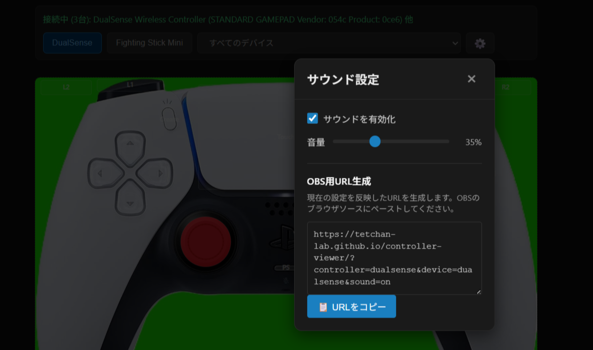

# Controller Viewer

**🌐 Live Demo:** https://tetchan-lab.github.io/controller-viewer/

配信・録画向けのゲームコントローラー入力可視化Webアプリです。
**DualSense（PlayStation 5）** と **Fighting Stick Mini（HORI アーケードスティック）** を主な対象とし、ボタンやレバーを押すとリアルタイムで色が変わります。

**主な更新履歴:**
- 2026/04/28：**入力サウンド機能の追加（実機からサウンド収録）**
- 2026/04/30：**すべてのSTANDARD GAMEPADデバイスに対応、デバイス選択機能を追加**
- 2026/04/30：**キーボード/マウス入力対応（ゲームパッド未接続でも動作）**
- 2026/05/01：**OBS用URL自動生成機能を設定モーダルに追加**

OBS などのブラウザソース（Browser Source）として読み込むだけで使えます。

---

## 目次

- [スクリーンショット](#スクリーンショット)
- [主な機能](#主な機能)
- [対応デバイス](#対応デバイス)
- [セットアップ](#セットアップ)
- [OBS での使い方](#obs-での使い方)
- [キーボード/マウス入力](#キーボードマウス入力)
- [デバイス選択機能](#デバイス選択機能)
- [サウンドシステム](#サウンドシステム)
- [クエリパラメーター一覧](#クエリパラメーター一覧)
- [カスタマイズ・技術仕様](#カスタマイズ技術仕様)
- [ライセンス](#ライセンス)

---

## スクリーンショット

### DualSense (PS5)


### Fighting Stick Mini (HORI)


### OBS用URL生成機能


歯車アイコン（⚙️）をクリックすると、現在の設定を反映したOBS用URLを自動生成してコピーできます。

---

## 主な機能

- **Gamepad API によるリアルタイム入力検出**（USB / Bluetooth 対応）
- **すべての STANDARD GAMEPAD デバイスに対応**
  - DualSense、Fighting Stick Mini の設定を自動適用、または手動選択可能
- **デバイス選択機能** - 複数コントローラー同時接続時に特定デバイスのみ表示
- **キーボード/マウス入力対応** - ゲームパッド未接続でも動作、実機と併用可能
- **リアルタイムサウンド再生** - 実機から収録した生音を再生（音量調整・ON/OFF 可能）
- **OBS 用 URL 自動生成** - 設定モーダルから現在の設定を反映した URL をワンクリックでコピー
- **OBS 対応** - 配信・録画用に最適化された透過表示とクエリパラメーター指定
- **レスポンシブ対応** - スマホ・タブレット・PCで正しく表示

詳細な技術仕様は **[docs/TECHNICAL.md](docs/TECHNICAL.md)** を参照してください。

---

## 対応デバイス

### ✅ すべての STANDARD GAMEPAD に対応

**Gamepad API の `mapping: "standard"` を持つコントローラーなら、メーカー・モデルを問わず動作します。**

### 自動判定対応デバイス

以下のデバイスは、接続時にデバイス名から自動的に設定が適用されます：

| デバイス | 自動判定キーワード |
|---|---|
| DualSense (PS5) | `DualSense`, `PS5 Controller`, `PlayStation 5` |
| Fighting Stick Mini (HORI) | `Fighting Stick`, `HORI`, `Arcade Stick`, `FS-Mini`, `XBOX 360 Controller` |

> **Note:** Fighting Stick Mini は Xbox 360 互換モードで動作するため、`"XBOX 360 Controller"` と報告されます。

その他の STANDARD GAMEPAD デバイス（Xbox Elite Controller、Switch Pro Controller など）も動作します。  
画面上部のボタンで手動でマッピングを選択してください。

---

## セットアップ

### 1. リポジトリをクローン

```bash
git clone https://github.com/tetchan-lab/controller-viewer.git
cd controller-viewer
```

### 2. ブラウザで開く

`index.html` をブラウザで直接開くか、ローカルサーバーを立ち上げます。

```bash
# Python を使った簡易サーバー（推奨）
python3 -m http.server 8080
# ブラウザで http://localhost:8080 を開く
```

> **Note:** `file://` プロトコルでは Gamepad API や Web Audio API が正しく動作しない場合があります。  
> ローカルサーバーの使用を推奨します。

### 3. コントローラーを接続

USB または Bluetooth でコントローラーを接続後、ブラウザ上で何かボタンを押してください。  
（ブラウザのセキュリティポリシーにより、ボタン入力後に Gamepad API が有効化されます）

自動的にデバイス名を検出し、対応するマッピングに切り替わります。

---

## OBS での使い方

### GitHub Pages で使用する場合（推奨）

GitHub Pages で公開されているため、ローカルサーバーなしで直接使用できます。

### 🆕 OBS用URL自動生成機能

**アプリ内の設定モーダルから、OBS用のURLを自動生成してコピーできます。**

#### 使い方

1. ブラウザで https://tetchan-lab.github.io/controller-viewer/ を開く
2. コントローラーを接続する
3. 画面右上の **歯車アイコン（⚙️）** をクリック
4. 「OBS用URL生成」セクションに現在の設定を反映したURLが自動生成される
   - コントローラー設定（DualSense / Fighting Stick Mini）
   - デバイス識別（複数接続時に自動区別）
   - サウンドのON/OFF状態
5. **📋 URLをコピー** ボタンをクリック
6. OBSのブラウザソースにペースト

> **メリット:** クエリパラメーターを手動で組み立てる必要がなく、デバイスIDも自動的に抽出されるため、  
> 複数のコントローラーを使用する場合でも簡単に設定できます。

#### 基本設定手順

1. OBS のソース一覧で **「ブラウザ」** を追加
2. 以下のいずれかのURLを「URL」欄にコピー＆ペースト：

**DualSense (PS5) 用：**
```
https://tetchan-lab.github.io/controller-viewer/?controller=dualsense
```

**Fighting Stick Mini 用：**
```
https://tetchan-lab.github.io/controller-viewer/?controller=fightingStickMini
```

3. 幅・高さを設定
   - DualSense: **幅 800 × 高さ 565**
   - Fighting Stick Mini: **幅 800 × 高さ 457**
4. OBS のフィルタで **「クロマキー」** を追加し、緑色を指定して背景を透過
5. **音声設定**（重要）：[OBS での音声設定](#obs-での音声設定) を参照して音量を調整してください

> **Note:** `?controller=` パラメーターを使用すると、コントローラー切り替えボタンとステータス表示が非表示になり、  
> OBS での使用に最適化された表示になります。

#### 複数のコントローラーを同時使用する場合

複数のコントローラーを個別のブラウザソースで表示したい場合は、`?device=` パラメーターを追加します。

```
https://tetchan-lab.github.io/controller-viewer/?controller=dualsense&device=0
https://tetchan-lab.github.io/controller-viewer/?controller=fightingStickMini&device=1
```

`?device=` には以下の形式が使用できます：
- **デバイスインデックス**: `0`, `1`, `2`...（接続順）
- **デバイスID部分一致**: `dualsense`, `xbox` など
- **ベンダーID:プロダクトID**: `054c:0ce6` など（最も確実）

詳細は [クエリパラメーター一覧](#クエリパラメーター一覧) を参照してください。

### ローカル環境で使用する場合

1. OBS のソース一覧で **「ブラウザ」** を追加
2. URL に `http://localhost:8080` を入力（またはクエリパラメーター付きURL）
3. 幅・高さを設定（上記と同じ）
4. クロマキーフィルタを追加して背景を透過
5. **音声設定**：[OBS での音声設定](#obs-での音声設定) を参照

---

### OBS での音声設定

コントローラーの操作音（サウンドシステム）は、OBSで初めて使用する際に**システム音量で再生される**ため、  
事前に音量を調整しないと大きな音が出て驚く可能性があります。以下の手順で設定してください。

#### 推奨設定手順（OBS音量ミキサーを使用）

1. **ブラウザソースを追加後、プロパティを開く**
   - ソース一覧で追加したブラウザソースを右クリック → 「プロパティ」

2. **「OBSで音声を制御する」にチェックを入れる**
   - プロパティウィンドウの下部にある「OBSで音声を制御する」にチェック
   - 「OK」をクリック

3. **OBS音量ミキサーで音量を調整**
   - OBSメイン画面の下部「音声ミキサー」にブラウザソースが表示される
   - スライダーを左に動かして音量を下げる（まずは0%から始めて徐々に上げることを推奨）

4. **音声モニタリングを設定（任意）**
   - 音声ミキサーのブラウザソース名の右にある歯車アイコン → 「オーディオの詳細プロパティ」
   - 音声モニタリングで「モニターと出力」を選択すると、自分でも音を確認しながら配信できます

#### サウンドを完全にオフにする方法（クエリパラメーター）

サウンド機能を使用しない場合は、URLに `?sound=off` を追加することで、サウンドシステムを完全に無効化できます。

```
# サウンドなしでDualSenseを表示
https://tetchan-lab.github.io/controller-viewer/?controller=dualsense&sound=off
```

この方法は、複数のブラウザソースで同じコントローラーを表示する際に、音声の重複を防ぐのに便利です。

#### アプリ内設定で調整する方法（非推奨）

通常画面（クエリパラメーターなし）で歯車アイコン（⚙️）から音量調整できますが、  
OBS用URLと別のURLになるため手間がかかります。OBS音量ミキサーの使用を推奨します。

> **Note:** サウンドシステムは、ゲームパッド接続時やボタン押下時に自動的に初期化されます。  
> OBSのブラウザソースでも、コントローラーを操作するだけで音が鳴るようになります。

---

## キーボード/マウス入力

ゲームパッドが手元にない場合でも、キーボードとマウスでコントローラー入力をシミュレートできます。  
実ゲームパッドと同時に使用した場合は、両方の入力が OR マージされます（どちらかが押されていれば反応）。

### キーマッピング

#### 十字キー / レバー / 左スティック（共用）

| キー | 入力 |
|---|---|
| W | 上 |
| S | 下 |
| A | 左 |
| D | 右 |

#### ボタン

| キー/マウス | ボタン |
|---|---|
| Space / Enter / マウス左クリック | × (Cross) |
| J | ○ (Circle) |
| K | □ (Square) |
| E | △ (Triangle) |
| O | L1 |
| P | R1 |
| R | Create / Share |
| Escape | Options |

#### 右スティック

| キー | 入力 |
|---|---|
| ↑（ArrowUp） | 上 |
| ↓（ArrowDown） | 下 |
| ←（ArrowLeft） | 左 |
| →（ArrowRight） | 右 |

> **Note:** テンキー（Numpad8/2/4/6）も右スティックとして使用できます。

### オンオフ切り替え

キーボード/マウス入力は、URLクエリパラメーター `?keyboard=` で制御できます。

```
# キーボード/マウス入力を無効化（実ゲームパッドのみ）
https://tetchan-lab.github.io/controller-viewer/?keyboard=off

# キーボード/マウス入力を有効化（デフォルト）
https://tetchan-lab.github.io/controller-viewer/?keyboard=on
```

**用途:** ゲームデバイスなしでの動作確認用。仮想デバイスでキーボード/マウス入力を設定している場合に音声重複を防止できます。

> **Note:** OBS のブラウザソースはキーボードイベントを受け取れないため、OBS では `?keyboard=off` の指定は不要です。

### 注意事項

- テキスト入力欄にフォーカスがある場合、キーボード入力は無効化されます
- ブラウザのデフォルト動作（Space でスクロールなど）は自動的に抑止されます
- ウィンドウがフォーカスを失うと、すべてのキー入力状態がリセットされます

### OBS での使用について

**OBS のブラウザソースはキーボードイベントを受け取れません。**  
OBS で キーボード入力を使用したい場合は、外部ツールでキーボード入力を仮想ゲームパッドに変換する必要があります。

#### 推奨ツール

- **[x360ce](https://www.x360ce.com/)** - キーボード→Xbox 360 コントローラーエミュレーション（無料）
- **[vJoy](http://vjoystick.sourceforge.net/) + [JoyToKey](https://joytokey.net/)** - 仮想ジョイスティックドライバ（無料）
- **[reWASD](https://www.rewasd.com/)** - キーボード→ゲームパッド変換（有料、簡単）

これらのツールで仮想ゲームパッドを作成すると、OBS のブラウザソースでも認識されます。

---

## デバイス選択機能

複数のコントローラーを同時接続している場合、特定のデバイスだけを表示することができます。

### UI での選択

画面上部のドロップダウンメニューから使用するデバイスを選択できます：

- **すべてのデバイス**：接続されているすべてのコントローラーの入力を受け付けます（デフォルト）
- **[0] デバイス名**：デバイスインデックス 0 番のコントローラーのみ
- **[1] デバイス名**：デバイスインデックス 1 番のコントローラーのみ

### クエリパラメーターでの指定

URL に `?device=` パラメーターを追加することで、特定のデバイスのみを表示できます。  
OBS で複数のブラウザソースを使用して異なるコントローラーを個別表示する場合に便利です。

詳細は [クエリパラメーター一覧](#クエリパラメーター一覧) をご覧ください。

---

## サウンドシステム

このアプリは **Web Audio API** を使用して、実際のコントローラーから録音した生音をリアルタイムで再生します。

### 機能

- **低レイテンシー再生**：ボタン・レバー・スティック操作に即座に反応
- **カテゴリ別サウンド**：
  - DualSense: 十字キー、ボタン、スティック、タッチパッド、Create/Options
  - Fighting Stick Mini: レバー、ボタン、上部小ボタン
- **音量調整とON/OFF**：歯車アイコン（⚙️）から設定可能
- **設定の永続化**：localStorage により設定を保存
- **自動初期化**：ゲームパッド接続・入力時に自動的にサウンドシステムを有効化（OBS対応）

### 音量調整

#### 通常の使い方
画面右上の歯車アイコン（⚙️）をクリックして設定モーダルを開き、音量スライダーで調整できます。

#### OBS での音量調整（推奨）

OBS で使用する場合は、**OBS の音量ミキサーを使う**ことを推奨します。  
詳細な手順は [OBS での音声設定](#obs-での音声設定) を参照してください。

1. ブラウザソースのプロパティから `OBSで音声を制御する` にチェック
2. OBS音量ミキサーでスライダーを調整（まずは0%から始めることを推奨）
3. `オーディオの詳細プロパティ` で音声モニタリングを設定（任意）
4. 他の音源とまとめて管理できるため便利

### 自動初期化の仕組み

ブラウザのセキュリティポリシー（Autoplay Policy）により、音声再生には通常ユーザーのクリック操作が必要です。  
しかし、このアプリでは以下のタイミングで自動的にサウンドシステムの初期化を試みます：

- ゲームパッド接続時
- ボタン押下検出時
- レバー/スティック入力検出時
- 画面クリック/タッチ時

これにより、OBS のブラウザソースとして使用する場合でも、コントローラーを操作するだけで音が鳴るようになります。

サウンドファイルの準備方法や詳細な技術仕様は **[sounds/README.md](sounds/README.md)** と **[docs/TECHNICAL.md](docs/TECHNICAL.md)** を参照してください。

---

## クエリパラメーター一覧

URLにクエリパラメーターを追加することで、表示や動作をカスタマイズできます。

| パラメーター | 値 | 説明 | 例 |
|---|---|---|---|
| `?controller=` | `dualsense` / `fightingStickMini` | コントローラーを固定表示（UI非表示） | `?controller=dualsense` |
| `?device=` | `0`, `1`, `2`...（インデックス） | 特定デバイスのみ受け付ける | `?device=0` |
| | `dualsense`, `xbox` など（部分一致） | デバイス名で指定 | `?device=dualsense` |
| | `054c:0ce6`（ベンダー:プロダクトID） | USB識別子で指定（最も確実） | `?device=054c:0ce6` |
| `?keyboard=` | `on` / `off` | キーボード/マウス入力の有効/無効 | `?keyboard=off` |
| `?sound=` | `on` / `off` | サウンド再生の有効/無効（OBS用） | `?sound=off` |
| `?debug` | （値不要） | デバッグモード（座標確認用） | `?debug` |

### 使用例

```
# DualSenseを固定表示（OBS用）
https://tetchan-lab.github.io/controller-viewer/?controller=dualsense

# デバイス0番のDualSenseのみ反応
https://tetchan-lab.github.io/controller-viewer/?controller=dualsense&device=0

# サウンドをオフにして使用（OBS用）
https://tetchan-lab.github.io/controller-viewer/?controller=dualsense&sound=off

# デバッグモードでボタン座標を確認
https://tetchan-lab.github.io/controller-viewer/?debug

# キーボード/マウス入力を無効化（実ゲームパッドのみ）
https://tetchan-lab.github.io/controller-viewer/?keyboard=off

# 複数パラメーターの組み合わせ（サウンドオフ＋デバイス指定）
https://tetchan-lab.github.io/controller-viewer/?controller=dualsense&device=0&sound=off
```

---

## カスタマイズ・技術仕様

より詳しい情報は以下のドキュメントを参照してください：

- **[docs/CONFIGURATION.md](docs/CONFIGURATION.md)** - カスタマイズガイド
  - コントローラー写真の差し替え方
  - ボタン座標の計測と再計算プロセス
  - 現在の座標マッピング詳細
  - ボタン番号一覧
  - 新しいコントローラーの追加方法

- **[docs/TECHNICAL.md](docs/TECHNICAL.md)** - 技術仕様
  - ファイル構成と役割
  - Gamepad API によるデバイス認識の仕組み
  - サウンドシステムの詳細実装
  - 設計メモ（後から調整しやすい構成について）

- **[sounds/README.md](sounds/README.md)** - サウンドファイル準備ガイド
  - 実機からの録音手順
  - 音声編集の方法

---

## ライセンス

MIT License — 詳細は [LICENSE](LICENSE) を参照してください。
